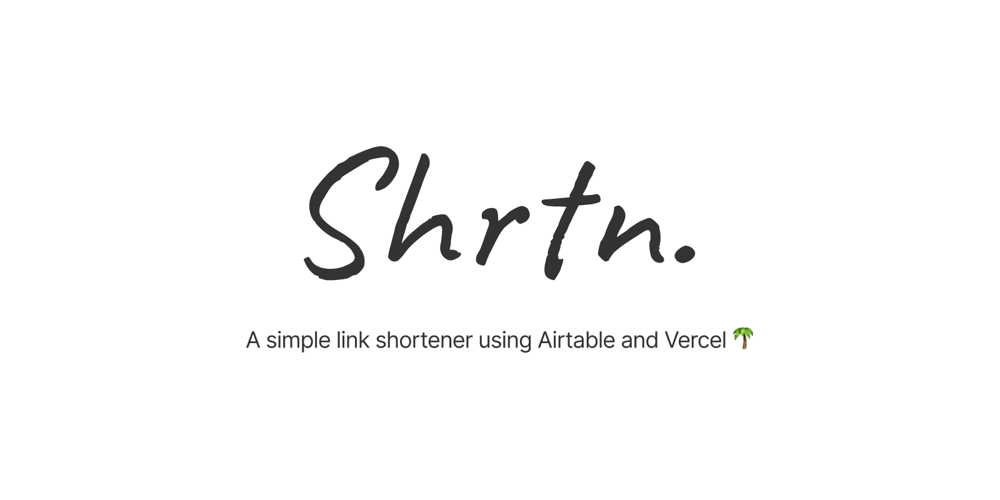

<!-- markdownlint-disable-file MD014 MD033 MD041 -->

<div align='center'>

[](.)

[](https://deploy.now.sh/?repo=https://github.com/grikomsn/shrtn&env=AIRTABLE_API_KEY&env=AIRTABLE_BASE_ID)

</div>

---

- [Deno version](#deno-version)
- [Examples](#examples)
- [Prerequisites](#prerequisites)
- [Usage](#usage)
  - [One-click deploy](#one-click-deploy)
  - [Fork and push to repository](#fork-and-push-to-repository)
- [Configuration](#configuration)
  - [Default redirect](#default-redirect)
- [Bug or feature request](#bug-or-feature-request)
- [License](#license)

---

## Deno version

This is the Node.js version of Shrtn. View the Deno version on
<https://github.com/grikomsn/shrtn-deno>.

## Examples

- Google: <https://shrtn.now.sh/google>
- Google (no cache): <https://shrtn.now.sh/google?nocache>
- Google (disabled): <https://shrtn.now.sh/google-disabled>
- Google (generated uid): <https://shrtn.now.sh/ecKS6s70c363wHYh>

View source links at the
[Shrtn Airtable base template](https://shrtn.now.sh/shrtn-template).

## Prerequisites

- **Mandatory** (for deployment purposes)

  - [Airtable account](https://airtable.com) and
    [API key](https://airtable.com/account)
  - [Shrtn Airtable base template](https://shrtn.now.sh/shrtn-template)
  - [Vercel account](https://vercel.com/home) +
    [GitHub integration](https://github.com/apps/now)

- **Optional** (for development purposes)
  - [Node.js](https://nodejs.org/en)
  - [Yarn](https://www.yarnpkg.com/lang/en) (optional)

## Usage

### One-click deploy

1. Copy the [Shrtn Airtable base template](https://shrtn.now.sh/shrtn-template)
   to your workspace

2. Generate your [Airtable API key](https://airtable.com/account)

3. Click 'deploy to now' button above and enter your API key and base ID to the
   environment variables prompted

4. Add your links to your copied Airtable base and enjoy

### Fork and push to repository

1. Copy the [Shrtn Airtable base template](https://shrtn.now.sh/shrtn-template)
   to your workspace

2. Generate your [Airtable API key](https://airtable.com/account)

3. Fork this repository

4. Add your API key to `vercel secrets`

   ```console
   $ vercel secrets add airtable-api-key keyXXXXXXXXXXXXXX
   ```

   > Note: [`vercel`](https://www.npmjs.com/package/vercel) is a CLI program
   > which you can install by running `npm -g i vercel` or
   > `yarn global add vercel`

5. Add your base ID on `vercel.json`

   ```json
   {
     "env": {
       "AIRTABLE_API_KEY": "@airtable-api-key",
       "AIRTABLE_BASE_ID": "appXXXXXXXXXXXXXX"
     }
   }
   ```

6. Push repository and Vercel will automagically deploy your instance

7. Add your links to your Airtable base and enjoy

## Configuration

### Default redirect

If base URL is accessed or no unique URL is given, the function will redirect to
a specific URL defined on the `vercel.json` configuration file.

You can configure the default redirect by changing
[the `redirects[0].destination` value on the `vercel.json` file](https://github.com/grikomsn/shrtn/blob/master/vercel.json#L25).

## Bug or feature request

[Submit an issue](https://github.com/grikomsn/shrtn/issues/new) if there's a bug
or if you have any ideas on how to improve this project.

## License

[MIT License Copyright (c) 2020 Griko Nibras](./LICENSE)
